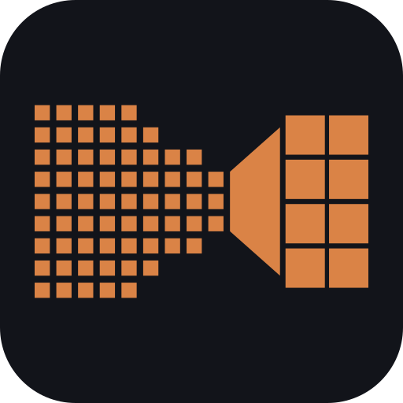

<a id="readme-top"></a>

<p align="center">
  
</p>

# ⟪ quantui-rs ⟫

**One static Rust binary that quantizes, converts, and casts Hugging Face `safetensors` models.** No Python, no torch, no runtime dependencies.

ComfyUI INT8 / FP8 / MXFP8 / NVFP4 · GGUF for the llama.cpp ecosystem · one single-file bf16/fp16/fp32 `.safetensors`.

**The contract:** output is byte-exact against the Python/torch and `llama.cpp` references on every default path. The handful of opt-in formats that trade that guarantee for accuracy say so on every run, on the [`parity:` line](#parity).


[![Rust][rust-shield]][rust-url]
[![License MIT][mit-shield]][license-url]
[![Platform][platform-shield]][building-url]


```sh
# Quantize to INT8 for ComfyUI
quantui-rs quantize mymodel.safetensors

# Convert to a GGUF (llama.cpp / unsloth ecosystem)
quantui-rs gguf mymodel.safetensors -m q8_0

# Merge a sharded HF model into ONE single-file bf16 .safetensors
quantui-rs cast ./my-hf-model --to bf16

# Quantize "aligned with" an existing reference GGUF
quantui-rs gguf model.safetensors out.gguf -m q8_0 \
    --recipe-from unsloth-Q8_0.gguf --verify-against unsloth-Q8_0.gguf
```

<details>
<summary><b>Table of Contents</b></summary>

- [Building](#building)
- [Commands](#commands)
- [Prebuilt binaries](#downloads)
- [Quantizing for ComfyUI (`quantize`)](#quantize)
- [Quality modes: `nvfp4_l2` and `nvfp4_rot16`](#quality-modes)
- [Parity contract, `parity:` marker & known boundaries](#parity)
- [Converting to GGUF (`gguf`)](#gguf)
- [Which GGUF method should I use?](#method-selection)
- [Per-tensor recipes & reference alignment](#recipes)
- [Validating (`validate`) and inspecting (`info`)](#validate-info)
- [Casting to a single-file model (`cast`)](#cast)
- [Exit codes](#exit-codes)
- [Reference: completions, worked examples, performance](#reference)
- [Development](#development) (see also [DEVELOPMENT.md](DEVELOPMENT.md))
- [License](#license)

</details>

<p id="building" align="center">◆◇◆◇◆◇◆◇◆◇◆</p>

## ❯ Building

Needs Rust stable ≥ 1.89. No other dependencies.

```sh
cargo build --release
# binary: target/release/quantui-rs(.exe)  (~2.6 MB, LTO + stripped)
```

On Windows the icon is **embedded into the executable's PE resource section**
by `crates/quant-cli/build.rs`, so Explorer, the taskbar and Alt-Tab all show it
without a companion file. Edit `assets/icon.svg`, then regenerate the shipped
`.ico` with `python tools/gen_icon.py` (needs `pip install pillow`). The build
panics if the `.ico` is missing rather than silently producing an icon-less
binary.

<p id="commands" align="center">◆◇◆◇◆◇◆◇◆◇◆</p>

## ❯ Commands

| Command | Purpose |
|---|---|
| `quantize` | safetensors → ComfyUI quantized safetensors (INT8 plain/Hadamard, FP8 E4M3, MXFP8, NVFP4) |
| `gguf` | safetensors → GGUF (34 usable llama.cpp methods, recipes, oracle verification) |
| `cast` | safetensors (single **or** sharded) → one bf16/fp16/fp32 `.safetensors`. **No quantization** |
| `validate` | Structural + numeric validation of a quantized output |
| `info` | Inspect a safetensors header without loading tensors |

`quantize`, `gguf` and `cast` all take a single `.safetensors` file **or** a
sharded HF model folder (one containing `model.safetensors.index.json`).

<p id="downloads" align="center">◆◇◆◇◆◇◆◇◆◇◆</p>

## ❯ Prebuilt binaries

Every release ships a ready-to-run binary. No install, no runtime, no
`cargo`.

| Platform | File | Notes |
|---|---|---|
| Linux x86_64 | `quantui-rs-<ver>-x86_64-unknown-linux-musl.tar.gz` | static, runs on any distro |
| Linux ARM64 | `quantui-rs-<ver>-aarch64-unknown-linux-musl.tar.gz` | static (Raspberry Pi, Graviton, Ampere) |
| Windows x86_64 | `quantui-rs-<ver>-x86_64-pc-windows-msvc.zip` | |
| macOS Apple Silicon | `quantui-rs-<ver>-aarch64-apple-darwin.tar.gz` | M1/M2/M3/M4 |
| macOS Intel | `quantui-rs-<ver>-x86_64-apple-darwin.tar.gz` | |

Verify a download against the `SHA256SUMS.txt` in the same release:

```sh
sha256sum -c SHA256SUMS.txt
```

The Linux builds are statically linked, so they do not depend on your
distribution's `glibc` version.

> **macOS:** the binaries are unsigned and not notarized, so Gatekeeper blocks
> them on first run. Check the checksum first, then allow it once via
> **System Settings → Privacy & Security → Open Anyway**. If no button appears,
> `xattr -d com.apple.quarantine ./quantui-rs-<ver>-aarch64-apple-darwin` does
> it. Downloading with `curl` instead of a browser usually skips the prompt
> entirely.

<p id="quantize" align="center">◆◇◆◇◆◇◆◇◆◇◆</p>

## ❯ Quantizing for ComfyUI (`quantize`)

### ▣ Quick start

```sh
# 1. Quantize. Defaults: INT8, block scaling, block size 128, heuristics on.
#    Output is auto-named next to the input.
quantui-rs quantize mymodel.safetensors
# -> wrote mymodel-int8_block-simple-heur.safetensors (N tensors, config_hash ...)

# 2. Verify it.
quantui-rs validate mymodel-int8_block-simple-heur.safetensors --numeric
# -> PASS

# 3. See what was produced.
quantui-rs info mymodel-int8_block-simple-heur.safetensors
```

Output is a standard `.safetensors` file. Every quantized layer carries a
`.comfy_quant` blob describing its layout.

### ▣ Which format to pick

`bpw` is rounded here and exact in the [full matrix](#quantize) below.

| `--format` | bpw | Parity | Use when |
|---|:---:|---|---|
| `int8` *(default)* | 8.00 | `exact` | The standard path. Block/row/tensor scaling, best tooling support |
| `int8_convrot` | 8.01 | `exact` | Want more accuracy at the same size. Hadamard-rotated INT8 |
| `fp8_e4m3` | 8.00 | `exact` | Your loader does FP8. Block/row/tensor scaling available |
| `mxfp8` | 8.25 | `exact` | Microscaling FP8. Fixed 32-element blocks, swizzled scales |
| `nvfp4` | 4.50 | `exact` | Maximum compression. Fixed 16-element blocks + tensor scale |
| `nvfp4_l2` | 4.50 | `quality-tuned` | 17.7% lower error, **not byte-exact**. See [Quality modes](#quality-modes) |
| `nvfp4_rot16` | 4.50 | `exact` | NVFP4 + Hadamard rotation at group size 16. See the caveat below |
| `int8_clip09` | 8.01 | ⚠️ worse | Measured negative result. Do not use |

> [!WARNING]
> **`int8_clip09` is a measured negative result.** Clipping regresses L2 error by
> 31×–1.4e4× depending on the distribution. It stays in the CLI so the
> measurement stays reproducible, not as a recommendation. Measurements in
> [Tried, measured, rejected](DEVELOPMENT.md#rejected).

<details>
<summary><b>Format &amp; parameter matrix</b></summary>

`bpw` is measured on-disk cost including scale overhead, for a 4096×4096 layer.

| `--format` | Scaling | Block | `X.weight` | `X.weight_scale` | Extra | bpw | Parity |
|---|---|---|---|---|---|---|---|
| `int8` | `block` | 64 | `I8` | `F32` `[r/64, c/64]` | `input_scale` | 8.008 | `exact` |
| `int8` | `block` | **128** *(default)* | `I8` | `F32` `[r/128, c/128]` | `input_scale` | 8.002 | `exact` |
| `int8` | `block` | 256 | `I8` | `F32` `[r/256, c/256]` | `input_scale` | 8.000 | `exact` |
| `int8` | `row` | — | `I8` | `F32` `[r, 1]` | `input_scale` | 8.008 | `exact` |
| `int8` | `tensor` | — | `I8` | `F32` scalar | `input_scale` | 8.000 | `exact` |
| `int8_convrot` | `row` *(forced)* | 256 group | `I8` | `F32` `[r, 1]` | `input_scale` | 8.008 | `exact` |
| `int8_clip09` | `row` | — | `I8` | `F32` `[r, 1]` | `input_scale` | 8.008 | ⚠️ measured-worse |
| `fp8_e4m3` | `block` | 64 | `F8_E4M3` | `F32` `[r/64, c/64]` | — | 8.008 | `exact` |
| `fp8_e4m3` | `block` | **128** *(default)* | `F8_E4M3` | `F32` `[r/128, c/128]` | — | 8.002 | `exact` |
| `fp8_e4m3` | `block` | 256 | `F8_E4M3` | `F32` `[r/256, c/256]` | — | 8.000 | `exact` |
| `fp8_e4m3` | `row` | — | `F8_E4M3` | `F32` `[r, 1]` | — | 8.008 | `exact` |
| `fp8_e4m3` | `tensor` | — | `F8_E4M3` | `F32` scalar | — | 8.000 | `exact` |
| `mxfp8` | `block` *(fixed)* | 32 | `F8_E4M3` | `U8` e8m0, swizzled `[256,4]` | — | **8.250** | `exact` |
| `nvfp4` | `block` *(fixed)* | 16 | `U8` (2×E2M1/byte) | `F8_E4M3`, swizzled `[256,8]` | `weight_scale_2` | **4.500** | `exact` |
| `nvfp4_l2` | `block` *(fixed)* | 16 | `U8` (2×E2M1/byte) | `F8_E4M3`, swizzled `[256,8]` | `weight_scale_2` | **4.500** | `quality-tuned` |
| `nvfp4_rot16` | `block` *(fixed)* | 16 + rot 16 | `U8` (2×E2M1/byte) | `F8_E4M3`, swizzled `[256,8]` | `weight_scale_2` | **4.500** | `exact` |

Three rules explain most of the table:

- **Scale overhead is negligible at 8-bit** (~8.00 bpw) and real at 4-bit:  MXFP8 adds 0.25 bpw, NVFP4 adds 0.5 bpw.
- **Fixed-block formats reject the sizing flags.** `mxfp8` and `nvfp4` pin block size to 32 and 16, so `-m` / `-b` exit 2. `int8_convrot` pins scaling to `row`.
- **Only 2D `*.weight` tensors divisible by the block size get quantized.** Everything else is copied at `--orig-dtype`. `mxfp8` and `nvfp4` add  `AVOID_KEY_NAMES` exclusions on top.

</details>

<details>
<summary><b>Full <code>quantize</code> parameter reference</b></summary>

```
quantui-rs quantize [OPTIONS] <INPUT> [OUTPUT]

  <INPUT>                 .safetensors file OR sharded HF model folder
  [OUTPUT]                .safetensors file (single/merged) or directory
                          (sharded); omitted = auto-named

      --format <FORMAT>   int8 | int8_convrot | fp8_e4m3 | mxfp8 |
                          nvfp4 | nvfp4_l2 | nvfp4_rot16 | int8_clip09
                                             [default: int8]
  -m, --scaling-mode <M>  tensor | row | block            [default: block]
  -b, --block-size <BS>   64 | 128 | 256                  [default: 128]
      --heur / --no-heur  Skip-inefficient-layers heuristic [default: on]
      --exclude-layers <RE>  Regex; matching layers stay full precision
      --only <PREFIX>     Quantize ONLY weights under this prefix (repeatable)
      --output-mode <M>   sharded | single                [default: sharded]
      --orig-dtype <D>    bfloat16 | float16 (skipped-weight cast)
                          [default: bfloat16]
      --calib-seed <N>    Bias-correction seed [default: 233983427]
      --simple            Accepted for reference compatibility (always on)
      --no-progress       Plain, CI-friendly output (no progress bar)
      --verify-output     Re-parse output header(s); exit 1 if corrupt
```

Guidance on the flags you are most likely to touch:

- **`-m block` with `-b 128`** is the default balance. Switch to `row` when the matrix dimensions do not divide by the block size, and to `tensor` only when you want the smallest possible file.
- **`--heur` (on by default)** keeps small or irregular layers in BF16, which is what stops accuracy from collapsing on them.
- **`--only <PREFIX>`** beats an inverted `--exclude-layers` regex. The regex engine has no lookaround, so "keep only X" spelled as an exclusion is a long alternation that is easy to typo and silently widens the artifact. To match ComfyUI's own `int8_convrot` selection on Qwen-Image 2.1, for example:  `--only transformer_blocks`.
- **`--exclude-layers`** is matched unanchored against the full tensor name, `.weight` suffix included. An invalid pattern exits 2, so a typo can never  quietly widen the artifact.
- **`--calib-seed`** is pinned to `233983427` for bit-for-bit parity with the reference implementation. Changing it changes your output bytes.

</details>

<details>
<summary><b>What gets quantized, and INT8 / FP8 details</b></summary>

| Tensor | Treatment |
|---|---|
| 2D `*.weight`, dimensions divisible by block size | **Quantized** |
| 2D `*.weight`, not divisible (with default `--heur`) | Copied as `--orig-dtype` (BF16) |
| 2D `*.weight` excluded by `--exclude-layers` / `--only` | Copied as `--orig-dtype` |
| Everything else (biases, norms, embeddings, …) | Copied unchanged |

A quantized layer emits four tensors: `X.weight` (data), `X.weight_scale`,
`X.comfy_quant` (ComfyUI layout blob), and `X.input_scale` (INT8 scalar 1.0).

**INT8 scaling modes.** `block` gives one scale per block-tile, the best
accuracy/size balance. `row` gives one scale per row and handles arbitrary
dimensions without padding. `tensor` gives one scalar for the whole tensor,
the coarsest of the three.

**`int8_convrot`** is row-wise INT8 plus a group-wise Hadamard rotation at group
size 256, applied to layers where `in_features % 256 == 0`. Everything else
falls back to plain row INT8.

**Sharded input.** Sharding is preserved by default:

```sh
quantui-rs quantize ./my-hf-model ./my-hf-model-int8      # one output per shard
quantui-rs quantize ./my-hf-model --output-mode single    # merge into one file
```

</details>

<p id="quality-modes" align="center">◆◇◆◇◆◇◆◇◆◇◆</p>

## ❯ Quality modes — `nvfp4_l2` and `nvfp4_rot16`

Both are opt-in. A default run never selects them.

| | `nvfp4_l2` | `nvfp4_rot16` |
|---|---|---|
| `parity:` | `quality-tuned` — **not byte-exact** | `exact` — **byte-exact** |
| What it does | Anchored alternating L2 search over the scale pair | Hadamard rotation at group size 16 |
| Why | Replaces absmax scaling with an L2 error search | Parity-exact transform, so no scale-selection drift |
| Measured | **17.7% lower aggregate L2 error** | Identical bytes to the transform baseline |
| Inherited | Fixed block 16, packed E2M1 | Group 16 matches the NVFP4 block size |

```sh
quantui-rs quantize mymodel.safetensors --format nvfp4_l2
# parity: quality-tuned (nvfp4_l2: NVFP4 anchored alternating L2 scale search; NOT byte-exact vs torch/llama-quantize)

quantui-rs quantize mymodel.safetensors --format nvfp4_rot16
# parity: exact (nvfp4_rot16; byte-exact vs torch/llama-quantize)
```

> [!CAUTION]
> **Rotations need runtime inverse rotation during inference.** Whether ComfyUI
> applies it cannot be verified from this repository, and NVFP4 metadata carries
> no rotation flag. If the loader does not invert the rotation, the output is
> corrupt. Treat downstream support as unverified until you confirm it with a
> real load.

<details>
<summary><b>How the L2 search and the rotation work</b></summary>

- **Error distribution.** The 17.7% aggregate gain varies by data profile:
  21–26% on uniform/Gaussian, 6–11% on heavy-tailed, 1.5–31% on spiky matrices.
- **Why the search is anchored.** The target `X̂ = s_T · s_G · Q(X/(s_T·s_G))` is
  flat along powers of two, because the E2M1 grid is `{2^j, 1.5·2^j}`. A naive
  search drifts arbitrarily far. The implementation restricts it to a bounded
  ±4 E4M3 window around the absmax anchor (arXiv:2509.23202).
- **Why group size 16.** Aligning the rotation group with the microscaling
  block halves online runtime cost (DuQuant++, arXiv:2604.17789; The Great
  Inversion, arXiv:2608.25188). A regular Hadamard construction avoids
  degenerate all-ones columns (ConvRot, arXiv:2512.03673).

</details>

<p id="parity" align="center">◆◇◆◇◆◇◆◇◆◇◆</p>

## ❯ Parity contract, `parity:` marker & known boundaries

Every `quantize` run prints exactly one unconditional `parity:` line. It is
derived from the core configuration, so it cannot drift from what the run
actually did:

```
parity: exact (nvfp4; byte-exact vs torch/llama-quantize)
parity: quality-tuned (nvfp4_l2: ...; NOT byte-exact vs torch/llama-quantize)
```

Exit code is `0` on a successful run either way, so automation should read the
marker rather than the exit status:

```sh
quantui-rs quantize m.safetensors --format nvfp4_l2 2>&1 | grep -q '^parity: quality-tuned' \
  && echo "NOT byte-exact — do not compare against reference bytes"
```

<details>
<summary><b>What is byte-exact</b></summary>

| Area | Verified against |
|---|---|
| INT8 streaming | Whole-file byte-for-byte identity against the reference, across all scaling modes, heuristics, and bias corrections |
| FP8, MXFP8, NVFP4 | Per-tensor exact match on payload, shape, and metadata |
| GGUF core methods | Legacy methods (F16 through Q5_1) against `gguf-py` (49/49 cases). K-quants and IQ quants against `llama-quantize` under imatrix calibration |
| Conformance vectors | Golden Ruler (arXiv:2606.09686v3), encode and decode directions, compared on integer bit patterns |

</details>

<details>
<summary><b>Where it deviates, and what is out of scope</b></summary>

Deviations, all opt-in and all announced on the `parity:` line:

| Format | Deviation |
|---|---|
| `nvfp4_l2` | Not byte-exact. Tuned via an L2 error search |
| `int8_clip09` | Not byte-exact, and measurably degrades numeric precision |
| `nvfp4_rot16` | Structurally exact, but inference needs a runtime inverse rotation |

Boundaries:

- Outputs are weight containers. They embed no tokenizer metadata (`tokenizer.ggml.*`) and need an external loader runtime such as ComfyUI.
- Ternary (`tq1_0` / `tq2_0`) and the 1/2-bit encoders are structurally validated. They have no reference parity target.
- Vision towers are not extracted into a separate `mmproj` file.

</details>

<p id="gguf" align="center">◆◇◆◇◆◇◆◇◆◇◆</p>

## ❯ Converting to GGUF (`gguf`)

### ▣ Quick start

```sh
quantui-rs gguf mymodel.safetensors                 # q4_k_m (default)
quantui-rs gguf ./my-hf-model -m q8_0 out.gguf      # sharded folder input
quantui-rs gguf mymodel.safetensors -m iq4_xs --imatrix imatrix.dat
quantui-rs gguf --list-methods                      # every method
```

Input path and output path are positional. The output defaults to
`<base>-<method>.gguf`.

What the converter handles for you:

- **Architecture metadata** read from `config.json` (`llama`, `qwen2/3`,
  `gemma`, `phi`, `lfm2`, …). Override with `--arch` if there is no
  `config.json`.
- **Tensor renaming** from HF names to llama.cpp conventions
  (`model.layers.0.self_attn.q_proj.weight` → `blk.0.attn_q.weight`). Anything
  unmapped passes through unchanged.
- **Spec compliance.** Tensors whose dimensions do not align with the block size
  are demoted automatically, matching the `llama-quantize` rules.
- **Nested and multimodal checkpoints.** Wrapper prefixes such as
  `model.language_model.*` and `model.model.*` collapse into standard `blk.*`
  keys, LFM2 / LFM2.5 hybrid cores map onto llama.cpp primitives, and vision
  towers plus projectors pass through under their original names. Architecture
  strings like `LFM2ForCausalLM` resolve to their `lfm2` keys.
- **Determinism.** Tensor data is quantized in parallel chunks, but ordering and
  metadata stay strictly deterministic, and the bytes are identical at any
  thread count. Tune with `QUANTUI_RS_GGUF_JOBS` (default: all logical cores).

<p align="right"><a href="#readme-top">⟔ ▲ ⟓ back to top</a></p>

<p id="method-selection" align="center">◆◇◆◇◆◇◆◇◆◇◆</p>

## ❯ Which GGUF method should I use?

| Goal | Method | Notes |
|---|---|---|
| Best overall size/quality at 4-bit | `q4_k_m` | Default. Keeps higher precision on key layers |
| Near-lossless | `q8_0` or `q6_k` | `q8_0` for compatibility, `q6_k` for smaller files |
| Smallest usable | `q4_k_s` → `q3_k_m` → `q2_k_l` | Progressively smaller. Check output quality |
| Extreme compression | `iq4_xs` → `iq3_m` → `iq2_m` | **Requires `--imatrix`** |
| BitNet ternary models | `tq1_0` / `tq2_0` | Only for ternary-trained models |
| Reference / debug | `f16`, `bf16`, `f32` | Unquantized |

**Always pass `--imatrix` for a K-quant.** Without one, K-quants fall back to a
simplified per-sub-block encoder instead of the iterative search llama.cpp uses,
and the CLI warns when it does. The simplified path is measurably worse: on
YuE2-3B Q2_K it lands at 0.3299 relative-L2, against 0.2694 for the weighted
path and 0.2984 for the published reference. Having no real importance matrix is
no excuse. `tools/make_uniform_imatrix.py` builds an all-ones one, which is
already enough to select the better encoder.

<p id="recipes" align="center">◆◇◆◇◆◇◆◇◆◇◆</p>

## ❯ Per-tensor recipes & reference alignment

Set bit width per layer with `--tensor-type-file`. Rules are regexes against the
GGUF tensor name, first match wins, with an optional trailing default:

```text
# Regex matches against GGUF tensor names (first match wins)
blk\.[0-9]+\.ffn_down\.weight=q6_k
attn_v\.weight=q5_k_s

# Trailing bare method acts as default fallback
q4_k_m
```

Dump the effective assignment with `--emit-recipe <PATH>`, and feed it back
through `--tensor-type-file` to reproduce the run exactly.

### ▣ `--recipe-from` — adopt a reference's assignment

```sh
quantui-rs gguf model.safetensors out.gguf -m q8_0 \
    --recipe-from unsloth-Q8_0.gguf \
    --verify-against unsloth-Q8_0.gguf
```

Extracts one exact-name rule per reference tensor (`^name$=qtype`) and applies
it through the same machinery, so llama.cpp mathematical compliance still holds.

### ▣ `--verify-against` — oracle equivalence report

Compares the output against a reference GGUF and classifies every difference:

| Class | Meaning |
|---|---|
| `DeadBlockCosmetic` | Blocks differ only where the scale is `0.0`, so `q·0 = 0` and the reconstruction is identical |
| `ScaleRuleDiff` | Different scale formula, e.g. MSE-tuned vs absmax. Valid divergence |
| `GenuineDivergence` | Same scale, different integer codes. **Potential bug** |
| `dtype mismatch` | Different quant type assigned to the tensor |
| `ours-only` / `reference-only` | Unmatched tensors, e.g. vision tower layers |

<p id="validate-info" align="center">◆◇◆◇◆◇◆◇◆◇◆</p>

## ❯ Validating (`validate`) and inspecting (`info`)

```sh
quantui-rs validate out.safetensors            # structural header check
quantui-rs validate out.safetensors --numeric  # full payload verification
quantui-rs validate ./sharded-output-dir/      # expands all shards in a folder

quantui-rs info model.safetensors         # per-tensor table + layout detection
quantui-rs info model.safetensors --raw   # raw JSON metadata header
```

`--numeric` checks INT8 bounds (±127, no −128), scale finiteness, E4M3 and e8m0
value ranges, and scalar sanity.

`--comfy` switches the check to ComfyUI's own loader contract instead of the
reference encoder's stricter one. The two disagree, so a file can pass one and
fail the other. Passing `--comfy` means contract-conformant, not proven
loadable.

<p id="cast" align="center">◆◇◆◇◆◇◆◇◆◇◆</p>

## ❯ Casting to a single-file model (`cast`)

Merges shards and converts float tensors into one unquantized `.safetensors` in
BF16, FP16, or FP32.

```sh
quantui-rs cast ./VibeVoice-1.5B --to bf16              # merge shards
quantui-rs cast ./my-model merged-f16.safetensors --to f16
```

```
quantui-rs cast [OPTIONS] <INPUT> [OUTPUT]

  <INPUT>                 .safetensors file OR sharded HF model folder
  [OUTPUT]                Target path (omitted = auto-named)
      --to <TO>           bf16 | f16 | f32            [required]
      --no-progress       Disable live progress display
```

- **No quantization metadata.** Clean weights with standard `{"format": "pt"}`.
  No `.comfy_quant`, no scale descriptors.
- **BF16 → BF16 is a verbatim copy**, never a round-trip through floats.
- **Narrowing overflow exits 1** rather than writing silent `Inf`, e.g. a value
  above 65504 on the way to FP16.
- **F64 input is refused**, which avoids double-rounding ambiguity.
- **Atomic writes.** Output goes to a temporary file and is renamed only on
  full completion. Sources are opened read-only.

<p id="exit-codes" align="center">◆◇◆◇◆◇◆◇◆◇◆</p>

## ❯ Exit codes

| Code | Meaning |
|---|---|
| `0` | Success |
| `1` | Runtime failure: I/O error, invalid input, numeric validation failure, FP16 overflow |
| `2` | Usage error: invalid arguments, missing input, missing `--imatrix` |
| `3` | GGUF spec violations found via `--verify-against` or `--audit` |
| `130` | Interrupted by Ctrl-C |

<p id="reference" align="center">◆◇◆◇◆◇◆◇◆◇◆</p>

## ❯ Reference

<details>
<summary><b>GGUF method capability matrix</b></summary>

| Method | Class | Parity |
|---|---|---|
| `f16`, `bf16`, `f32` | usable, no imatrix | byte-exact vs gguf-py |
| `q8_0`, `q4_0`, `q4_1`, `q5_0`, `q5_1` | usable, no imatrix | byte-exact vs gguf-py (49/49 golden cases) |
| `q2_k`, `q2_k_l`, `q3_k_*`, `q4_k_*`, `q5_k_*`, `q6_k` | usable, no imatrix | byte-exact vs llama-quantize |
| `iq1_s/m`, `iq2_*`, `iq3_*`, `iq4_nl/xs` | usable, **requires `--imatrix`** | byte-exact vs llama-quantize |
| `tq1_0`, `tq2_0`, `q1_0`, `q2_0` | usable, no imatrix | structural verification only |
| `q4_nl`, `q4_k_xl`, `q3_k_xl`, `q2_k_xl` | **rejected**, exit 2 | Unsloth Dynamic 2.0 presets, unsupported natively |

Every `iq*` method requires `--imatrix <PATH>` (GGUF or legacy binary). K-quants
accept one optionally, and you should pass one.

</details>

<details>
<summary><b>Full <code>gguf</code> parameter reference</b></summary>

```
quantui-rs gguf [OPTIONS] [INPUT] [OUTPUT]

  [INPUT]    single .safetensors file OR sharded HF model folder
  [OUTPUT]   .gguf file (omitted = auto-named <base>-<method>.gguf)

  -m, --method <METHOD>          GGUF method id [default: q4_k_m]
      --imatrix <PATH>           Importance matrix (required for iq* methods)
      --tensor-type-file <PATH>  Per-tensor recipe file
      --token-embedding-type <M> Override token_embd.weight quant
      --output-tensor-type <M>   Override output.weight quant
      --emit-recipe <PATH>       Dump effective per-tensor assignment
      --verify-against <REF>     Oracle equivalence report vs reference GGUF
      --recipe-from <REF>        Extract and apply recipe from reference GGUF
      --audit <FILE.GGUF>        Audit existing GGUF (dtype census + spec check)
      --arch <ARCH>              Override GGUF arch string
      --name <NAME>              Override general.name metadata
      --list-methods             List all available methods and exit
      --no-progress              Plain, CI-friendly output
```

`--audit` inspects any GGUF for spec conformance (`ne[0] % block_size == 0`) and
prints a dtype census. It exits `0` on a clean file, `3` on spec violations, and
`1` on a parse failure.

```sh
quantui-rs gguf --audit model-Q8_0.gguf
# audit: model-Q8_0.gguf (266 tensors)
#   dtype histogram: F16=2, F32=99, Q8_0=165
#   spec-conformance: OK (0 violations)
```

</details>

<details>
<summary><b>Worked examples on real models</b></summary>

**LFM2.5-VL-3B → Q8_0, aligned with unsloth**

```sh
quantui-rs gguf LFM2.5-VL-3B-original.safetensors LFM2.5-VL-3B-Q8_0-ours.gguf \
    -m q8_0 --arch lfm2 \
    --recipe-from LFM2.5-VL-3B-Q8_0-unsloth.gguf \
    --verify-against LFM2.5-VL-3B-Q8_0-unsloth.gguf
```

167 extracted rules. 141 tensors byte-exact, 26 dead-block differences with
identical reconstruction, 0 divergences, 0 spec violations. The unmatched layers
are the separate `mmproj` vision components.

**VibeVoice-1.5B → Q8_0**

```sh
quantui-rs gguf VibeVoice-1.5B-bf16.safetensors VibeVoice-1.5B-q8_0.gguf -m q8_0
```

LM modules map to `blk.*`, tokenizer heads keep their original names, and
non-compliant convolution kernels are demoted to F16.

**VibeVoice-1.5B → single-file bf16**

```sh
quantui-rs cast ./VibeVoice-1.5B --to bf16
# cast: 1204 tensors, lossless (BF16 -> BF16, verbatim copy)
```

3 shards merged into one 5.04 GiB file, payloads untouched.

</details>

<details>
<summary><b>Shell completions</b></summary>

```sh
# bash
quantui-rs completions bash > ~/.local/share/bash-completion/completions/quantui-rs

# zsh
quantui-rs completions zsh > "${fpath[1]}/_quantui-rs"

# fish
quantui-rs completions fish > ~/.config/fish/completions/quantui-rs.fish

# PowerShell
quantui-rs completions powershell >> $PROFILE
```

</details>

### ▣ Performance

1.004 GiB fixture (32 × 4096 × 4096 bf16) on a 24-core system:

| Metric | Rust | Python ref | Ratio |
|---|---|---|---|
| End-to-end 1 GiB streaming | 4.10 s (250 MiB/s) | 4.80 s (214 MiB/s) | 1.17× |
| CPU quant kernel (4096×4096) | 68.6 ms (933 MiB/s) | 127.5 ms (245 MiB/s) | 1.86× |

Reproduce with `cargo bench -p quant-core` and `tools/bench_python_ref.py`.

<p id="development" align="center">◆◇◆◇◆◇◆◇◆◇◆</p>

## ❯ Development

**[DEVELOPMENT.md](DEVELOPMENT.md)** covers the repository layout, benchmark
suites, test fixtures, GGUF tooling scripts, and the notes on rejected
experiments.

<p id="license" align="center">◆◇◆◇◆◇◆◇◆◇◆</p>

## ❯ License

MIT. See [LICENSE](LICENSE).

Third-party notices: [THIRD_PARTY_NOTICES.md](THIRD_PARTY_NOTICES.md) ·
Contributing: [CONTRIBUTING.md](CONTRIBUTING.md) ·
Security reports: [SECURITY.md](SECURITY.md)

<!-- HEADER BADGES -->

[rust-shield]: https://img.shields.io/badge/Rust-1.89%2B-000000?style=for-the-badge&logo=rust&logoColor=white
[rust-url]: https://www.rust-lang.org
[mit-shield]: https://img.shields.io/badge/License-MIT-8957e5?style=for-the-badge&logo=opensourceinitiative&logoColor=white
[license-url]: LICENSE
[platform-shield]: https://img.shields.io/badge/platform-Windows%20%7C%20Linux%20%7C%20macOS-000000?style=for-the-badge&logo=github&logoColor=white
[building-url]: #building
[parity-shield]: https://img.shields.io/badge/parity-exact%20on%20default%20paths-8957e5?style=for-the-badge&logo=shield&logoColor=white
[parity]: #parity
[stars-shield]: https://img.shields.io/github/stars/wildminder/quantui-rs?style=for-the-badge&logo=github&logoColor=white
[stars-url]: https://github.com/wildminder/quantui-rs/stargazers
[commit-shield]: https://img.shields.io/github/last-commit/wildminder/quantui-rs?style=for-the-badge&logo=github&logoColor=white
[commit-url]: https://github.com/wildminder/quantui-rs/commits/main
